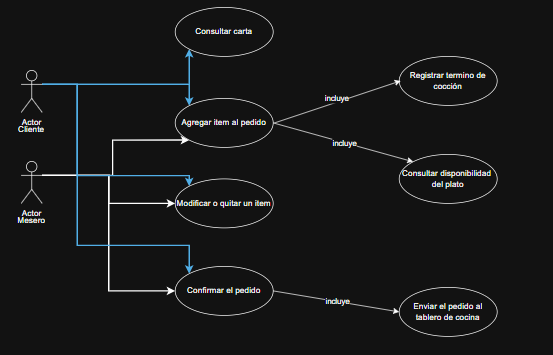
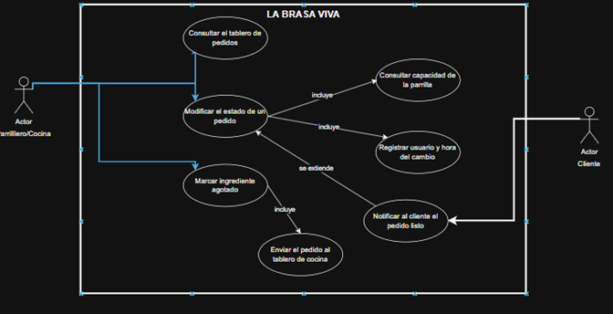
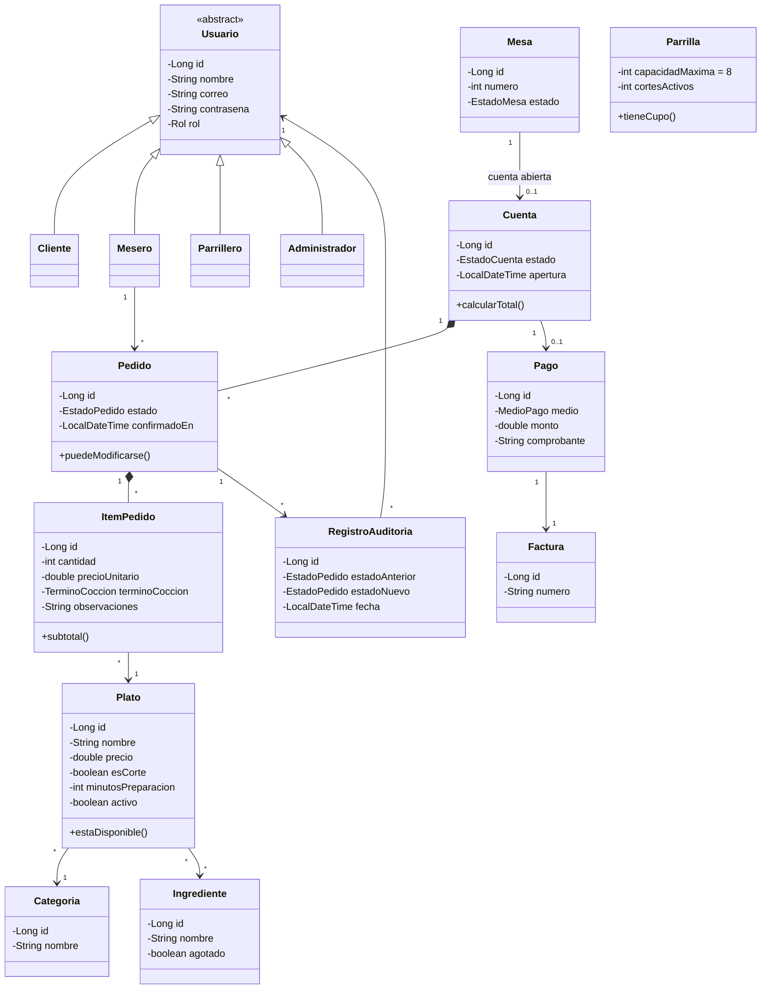
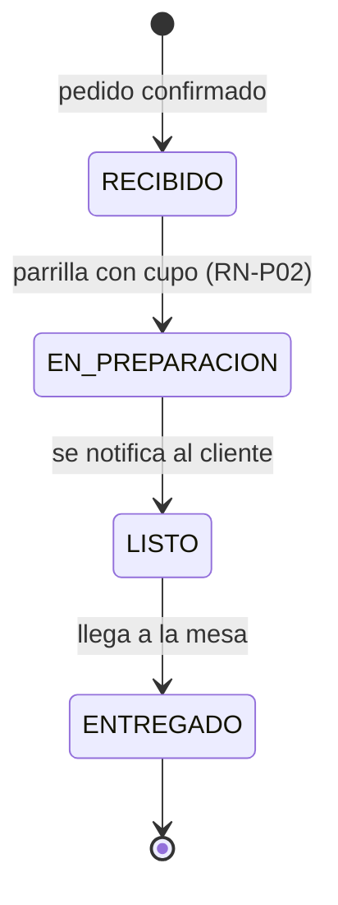

# LA BRASA VIVA 🔥

**Bitácora Corte 2 — Desarrollo y Operaciones de Software (DOSW)**
Escuela Colombiana de Ingeniería Julio Garavito
Autor: Julian Felipe Morales Zambrano

Proyecto base: [Laboratorio 3 — DOSW_LABORATORIO_3_CarlosCristianJulian](https://github.com/cristianmorenor/DOSW_LABORATORIO_3_CarlosCristianJulian)

---

## Descripción del restaurante

**LA BRASA VIVA** es un restaurante de parrilla. Esta API digitaliza el ciclo completo de una orden:
consulta de la carta con disponibilidad en tiempo real, armado y confirmación del pedido con el
término de cocción de cada corte, tablero de cocina, y cierre de la cuenta con su pago.

Hoy la operación se maneja con comandas en papel y llamados verbales a la cocina, lo que genera
cortes vendidos sin inventario, términos de cocción mal comunicados, cero visibilidad del estado
del pedido entre salón y cocina, y ningún dato de ventas para decidir.

El MVP valida el ciclo **carta → pedido → cocina → pago** antes de escalar a domicilios y reservas.

### Actores

| Rol | Qué hace |
|---|---|
| Cliente | Consulta la carta, arma su pedido, elige el término de cocción y sigue su preparación |
| Mesero | Toma y modifica órdenes, las envía a cocina y cierra la cuenta |
| Parrillero / Cocina | Opera el tablero de cocina, actualiza estados y marca ingredientes agotados |
| Administrador | Administra carta, inventario y usuarios, y consulta reportes de venta |

### Reglas de negocio

| Código | Regla |
|---|---|
| RN-01 | Un pedido solo se modifica en estado `RECIBIDO` |
| RN-02 | Un plato no puede ordenarse si algún ingrediente está agotado |
| RN-03 | Una mesa tiene una sola cuenta abierta; se cierra al registrar el pago |
| RN-04 | El precio queda congelado al agregar el plato al pedido |
| RN-P01 | Todo corte debe registrar su término de cocción |
| RN-P02 | La parrilla admite máximo 8 cortes simultáneos; el resto queda en cola |
| RN-P03 | Un corte de más de 25 min no puede ordenarse en los últimos 30 min de servicio |

---

## Diagramas

### Diagrama de contexto (C4 — Nivel 1)


### Casos de uso

**RF-03 — Agregar ítem al pedido con término de cocción**



**RF-06 — Cambiar el estado de un pedido en el tablero de cocina**



**RF-09 — Cerrar la cuenta y registrar el pago**


### Diagrama de clases



### Estados del pedido



---

## Estructura del proyecto

```
src/main/java/edu/escuelaing/dosw/brasaviva
├── BrasaVivaApplication.java
├── model/        entidades y enums del dominio
├── repository/   acceso a datos
├── service/      lógica de negocio (identidad, carta, pedidos, cocina, inventario, pagos, reportes)
├── controller/   endpoints REST
├── dto/          objetos de entrada y salida
├── client/       integraciones externas (pasarela, facturación DIAN, notificaciones)
├── exception/    excepciones de las reglas de negocio
└── config/       configuración
```

## Tecnologías

Java 21 · Maven · Spring Boot 3.3.4 · Lombok · JUnit 5 · Mockito · JaCoCo

## Ejecución

```bash
mvn clean install
mvn spring-boot:run
```

---

## Funcionalidades

La API agrupa sus endpoints por área funcional del restaurante. Cada grupo corresponde a un
`@Tag` de Swagger y a un controlador independiente:

### Menú (`/api/v1/menu`) — consulta del cliente

| Método | Endpoint | Descripción |
|---|---|---|
| GET | `/api/v1/menu` | Ver el menú (solo platos disponibles), filtro opcional por categoría |
| GET | `/api/v1/menu/{id}` | Ver el detalle de un plato del menú |

### Platos (`/api/v1/platos`) — administración de la carta

| Método | Endpoint | Descripción |
|---|---|---|
| GET | `/api/v1/platos` | Obtener todos los platos, incluye los agotados |
| GET | `/api/v1/platos/{id}` | Obtener un plato por id |
| POST | `/api/v1/platos` | Crear un plato (disponible por defecto) |
| PUT | `/api/v1/platos/{id}` | Actualizar nombre, precio, categoría, descripción y tiempo |
| PATCH | `/api/v1/platos/{id}/disponible` | Marcar disponible o agotado (RN-02) |
| DELETE | `/api/v1/platos/{id}` | Eliminar un plato de la carta |

### Mesas (`/api/v1/mesas`) — salón

| Método | Endpoint | Descripción |
|---|---|---|
| GET | `/api/v1/mesas` | Ver todas las mesas, filtro opcional por estado (DISPONIBLE, OCUPADA, RESERVADA) |
| GET | `/api/v1/mesas/{id}` | Ver una mesa |
| POST | `/api/v1/mesas` | Crear una mesa |

### Reservas (`/api/v1/reservas`)

| Método | Endpoint | Descripción |
|---|---|---|
| POST | `/api/v1/reservas` | Crear una reserva (bloqueo de 2 horas) |
| GET | `/api/v1/reservas` | Ver reservas, filtro opcional por cliente |
| GET | `/api/v1/reservas/{id}` | Ver una reserva |
| PUT | `/api/v1/reservas/{id}` | Actualizar o reprogramar una reserva |
| DELETE | `/api/v1/reservas/{id}` | Cancelar una reserva |

### Pedidos y Cocina (`/api/v1/pedidos`) — núcleo del negocio

| Método | Endpoint | Descripción |
|---|---|---|
| POST | `/api/v1/pedidos` | Confirmar un pedido, congela precios (RN-04) y exige término en cortes (RN-P01) |
| GET | `/api/v1/pedidos` | Ver todos los pedidos, filtro opcional por estado |
| GET | `/api/v1/pedidos/cocina` | Tablero de cocina: pedidos RECIBIDO y EN_PREPARACION en orden de llegada |
| GET | `/api/v1/pedidos/mesa/{idMesa}` | Ver pedidos activos de una mesa |
| GET | `/api/v1/pedidos/{id}` | Ver un pedido |
| POST | `/api/v1/pedidos/{id}/items` | Agregar un plato a un pedido (RN-01) |
| PATCH | `/api/v1/pedidos/{id}/estado` | Cambiar el estado de un pedido (RN-P02) |
| DELETE | `/api/v1/pedidos/{id}` | Cancelar un pedido (solo si sigue en RECIBIDO) |

### Cuentas y Pagos (`/api/v1/cuentas`)

| Método | Endpoint | Descripción |
|---|---|---|
| POST | `/api/v1/cuentas` | Abrir cuenta en una mesa (RN-03) |
| GET | `/api/v1/cuentas/{id}` | Ver una cuenta; si está abierta, el total se recalcula con los pedidos actuales |
| GET | `/api/v1/cuentas/mesa/{idMesa}` | Ver la cuenta abierta de una mesa |
| POST | `/api/v1/cuentas/{id}/pago` | Registrar pago y cerrar la cuenta (todos los pedidos deben estar ENTREGADOS) |

### Parqueadero (`/api/v1/parqueadero`)

| Método | Endpoint | Descripción |
|---|---|---|
| POST | `/api/v1/parqueadero/entrada` | Registrar entrada de un vehículo |
| POST | `/api/v1/parqueadero/salida/{placa}` | Registrar salida y calcular el cobro por hora o fracción |
| GET | `/api/v1/parqueadero/activos` | Ver vehículos activos |
| GET | `/api/v1/parqueadero/disponibilidad` | Ver cupos disponibles |

### Reportes (`/api/v1/reportes`) — inteligencia del negocio

| Método | Endpoint | Descripción |
|---|---|---|
| GET | `/api/v1/reportes/resumen` | Resumen del día: total de pedidos, ingresos, platos más pedidos y mesas con cuenta abierta |
| GET | `/api/v1/reportes/platos-populares` | Platos más vendidos |
| GET | `/api/v1/reportes/ingresos` | Ingresos por categoría en un rango de fechas (`yyyy-MM-dd`) |

---

## Evidencia de Swagger

La API está documentada con **springdoc-openapi / Swagger UI**, disponible en
`/swagger-ui/index.html` una vez la aplicación está corriendo. Cada endpoint incluye resumen,
descripción de la regla de negocio asociada y los códigos de respuesta esperados.

**Vista general de los grupos de endpoints (Tags)**


**Grupo Platos**


**Grupo Pedidos**


**Ejemplo de respuesta exitosa (201 Created)**


**Ejemplo de manejo de errores y validaciones (422 Unprocessable Entity)**


---

## Cobertura de pruebas y análisis estático

### Pruebas — TDD (ciclo rojo/verde)

El desarrollo de los servicios siguió el ciclo TDD: primero la prueba que falla, luego la
implementación mínima para pasarla.

**Prueba en rojo (falla antes de implementar)**


**Prueba en verde (pasa tras implementar)**


### Cobertura — JaCoCo

**Cobertura antes de completar las pruebas**


**Cobertura final del proyecto**


**Reporte detallado de cobertura por paquete**


### Análisis estático — SonarQube

> ⚠️ Pendiente: el análisis con Sonar no pudo cargarse en este corte por un problema con la
> instancia local/servidor. Se agregará la evidencia (issues, code smells, duplicated lines,
> security hotspots) tan pronto quede disponible.

---

## Evidencia de ejecución y pruebas por funcionalidad

| Funcionalidad | Clase de servicio | Clase(s) de prueba |
|---|---|---|
| Carta y administración de platos | `PlatoService` | `PlatoServiceTest`, `PlatoMapperTest` |
| Mesas y salón | `MesaService` | `MesaServiceTest` |
| Reservas | `ReservaService` | `ReservaServiceTest` |
| Pedidos y cocina | `PedidoService` | `PedidoServiceTest`, `PedidoMapperTest` |
| Cuentas y pagos | `CuentaService` | `CuentaServiceTest` |
| Parqueadero | `ParqueaderoService` | `ParqueaderoServiceTest` |
| Reportes | `ReporteService` | `ReporteServiceTest` |
| Modelo de dominio (entidades y enums) | `model` | `ModeloDominioTest` |

Todas las pruebas se ejecutan con:

```bash
mvn test
```

Los reportes de JaCoCo se generan en `target/site/jacoco/index.html` tras correr:

```bash
mvn clean verify
```
