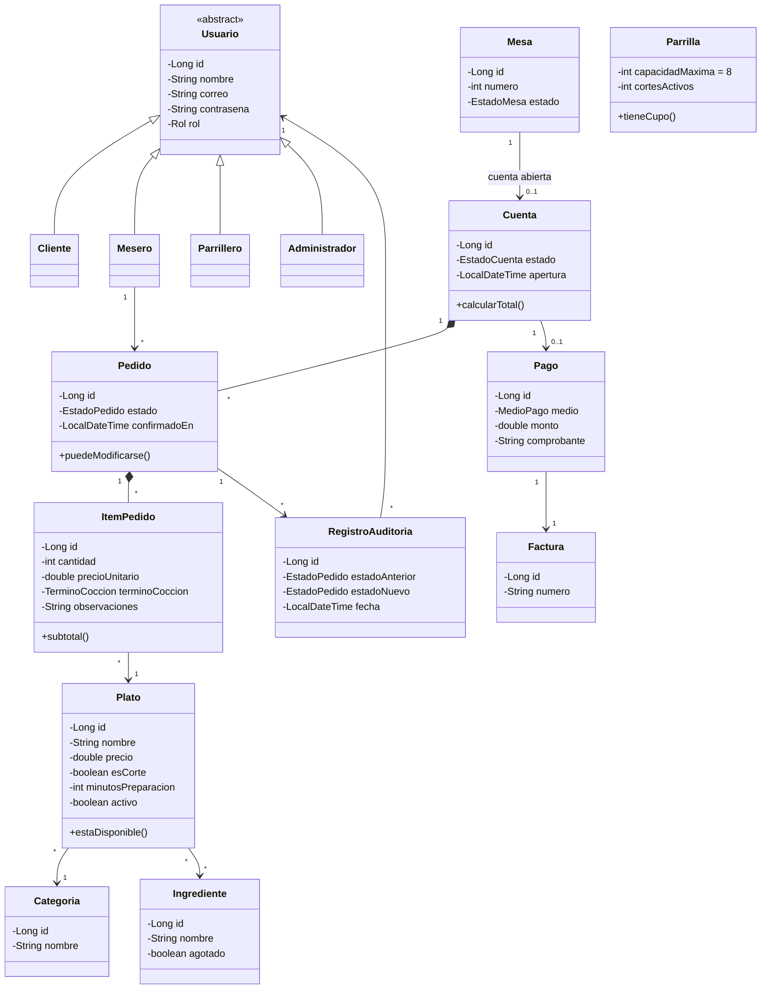
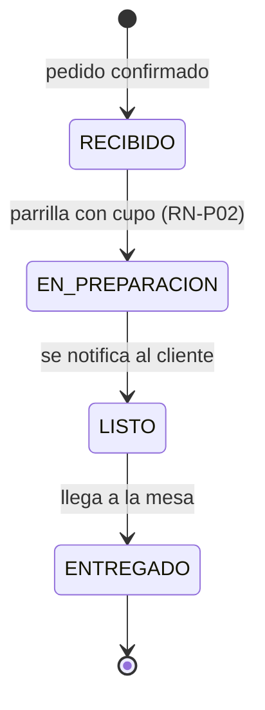

# LA BRASA VIVA 🔥

**Bitácora Corte 2 — Desarrollo y Operaciones de Software (DOSW)**
Escuela Colombiana de Ingeniería Julio Garavito
Autor: Julian Felipe Morales Zambrano

Proyecto base: [Laboratorio 3 — DOSW_LABORATORIO_3_CarlosCristianJulian](https://github.com/cristianmorenor/DOSW_LABORATORIO_3_CarlosCristianJulian)

---

## Descripción del restaurante

**LA BRASA VIVA** es un restaurante de parrilla. Esta API digitaliza el ciclo completo de una orden:
consulta de la carta con disponibilidad en tiempo real, armado y confirmación del pedido con el
término de cocción de cada corte, tablero de cocina, y cierre de la cuenta con su pago.

Hoy la operación se maneja con comandas en papel y llamados verbales a la cocina, lo que genera
cortes vendidos sin inventario, términos de cocción mal comunicados, cero visibilidad del estado
del pedido entre salón y cocina, y ningún dato de ventas para decidir.

El MVP valida el ciclo **carta → pedido → cocina → pago** antes de escalar a domicilios y reservas.

### Actores

| Rol | Qué hace |
|---|---|
| Cliente | Consulta la carta, arma su pedido, elige el término de cocción y sigue su preparación |
| Mesero | Toma y modifica órdenes, las envía a cocina y cierra la cuenta |
| Parrillero / Cocina | Opera el tablero de cocina, actualiza estados y marca ingredientes agotados |
| Administrador | Administra carta, inventario y usuarios, y consulta reportes de venta |

### Reglas de negocio

| Código | Regla |
|---|---|
| RN-01 | Un pedido solo se modifica en estado `RECIBIDO` |
| RN-02 | Un plato no puede ordenarse si algún ingrediente está agotado |
| RN-03 | Una mesa tiene una sola cuenta abierta; se cierra al registrar el pago |
| RN-04 | El precio queda congelado al agregar el plato al pedido |
| RN-P01 | Todo corte debe registrar su término de cocción |
| RN-P02 | La parrilla admite máximo 8 cortes simultáneos; el resto queda en cola |
| RN-P03 | Un corte de más de 25 min no puede ordenarse en los últimos 30 min de servicio |

---

## Diagramas

### Diagrama de contexto (C4 — Nivel 1)


### Casos de uso

**RF-03 — Agregar ítem al pedido con término de cocción**


**RF-06 — Cambiar el estado de un pedido en el tablero de cocina**


**RF-09 — Cerrar la cuenta y registrar el pago**


### Diagrama de clases



### Estados del pedido



---

## Estructura del proyecto

```
src/main/java/edu/escuelaing/dosw/brasaviva
├── BrasaVivaApplication.java
├── model/        entidades y enums del dominio
├── repository/   acceso a datos
├── service/      lógica de negocio (identidad, carta, pedidos, cocina, inventario, pagos, reportes)
├── controller/   endpoints REST
├── dto/          objetos de entrada y salida
├── client/       integraciones externas (pasarela, facturación DIAN, notificaciones)
├── exception/    excepciones de las reglas de negocio
└── config/       configuración
```

## Tecnologías

Java 21 · Maven · Spring Boot 3.3.4 · Lombok · JUnit 5 · Mockito · JaCoCo

## Ejecución

```bash
mvn clean install
mvn spring-boot:run
```
